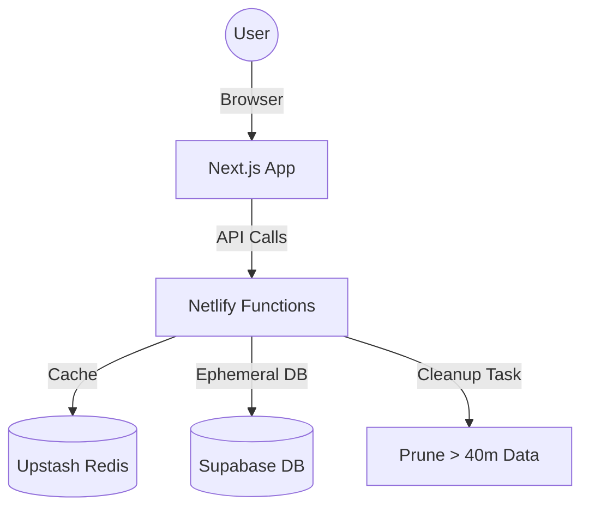

# 🚀 Hosting MockFlow on Netlify

In Netlify, your **Frontend and Backend live together as one single site.** You don't need to deploy them separately!

### 🌍 One Site, Two Roles
- **Frontend:** Your Next.js app (the pages you see).
- **Backend:** Netlify Functions (the logic that handles API calls).

When you deploy, Netlify builds your pages and sets up your backend "Serverless Functions" at the same time. Everything is managed under one site URL.

## 📋 Pre-deployment Checklist

Before you deploy, ensure you have these values ready from your dashboards:

| Service | Required Variable | Description |
| :--- | :--- | :--- |
| **Supabase** | `NEXT_PUBLIC_SUPABASE_URL` | Your project URL |
| **Supabase** | `NEXT_PUBLIC_SUPABASE_ANON_KEY` | Public API key |
| **Supabase** | `SUPABASE_SERVICE_KEY` | **Secret** key (Required for the 40m Cleanup) |
| **Upstash** | `UPSTASH_REDIS_URL` | Redis REST URL |
| **Upstash** | `UPSTASH_REDIS_TOKEN` | Redis REST Token |

---

## 🛠️ Step-by-Step Deployment

### Option 1: GitHub (Recommended)
Push your latest code to a GitHub repository and link it to a new site in the [Netlify Dashboard](https://app.netlify.com). Netlify will handle all builds and environment variables automatically.

### Option 2: Manual Deployment (No GitHub)
If you want to build locally and "put" it on Netlify manually, use these exact commands in your terminal:

#### 1. Install CLI & Login
```bash
npm install netlify-cli -g
netlify login
```

#### 2. Build the Project
Run this from the **main folder** (where `netlify.toml` is):
```bash
# Install dependencies
cd frontend && npm install && cd ..

# Build the UI
cd frontend && npm run build && cd ..
```

#### 3. Deploy Manually
This command "puts" your local build and your backend functions onto Netlify:
```bash
netlify deploy --prod --dir=frontend/.next --functions=backend/netlify/functions
```

> [!IMPORTANT]
> **Environment Variables:** After deploying, you MUST go to the Netlify Dashboard to add your Supabase and Redis keys, or the backend functions will fail!

### Option 3: Drag & Drop (Manual Folder)
If you want to use the Netlify Drag & Drop UI, you must create a single "Deployment Folder" that contains both the Frontend and Backend.

**1. Enable Static Export (Required for Drag & Drop)**
Next.js apps need to be "exported" to work with raw folder drops.
- Open `frontend/next.config.ts`.
- Add `output: 'export'` to the config.
- Add `images: { unoptimized: true }` to the config.

**2. Build the UI**
In the `frontend` folder, run:
```bash
npm run build
```
This will create an `out` folder.

**3. Prepare the "Upload" Folder**
Create a new folder on your Desktop called `MockFlow-Deploy`.
- Copy **every file** from `frontend/out` into `MockFlow-Deploy`.
- Create a folder named `netlify` inside `MockFlow-Deploy`.
- Create a folder named `functions` inside that `netlify` folder.
- Copy your backend functions from `backend/netlify/functions/` into `MockFlow-Deploy/netlify/functions/`.
- Copy the root `netlify.toml` into `MockFlow-Deploy`.

**4. Drag & Drop**
Drag the `MockFlow-Deploy` folder onto [Netlify Drop](https://app.netlify.com/drop).

> [!CAUTION]
> **Dynamic Routes:** Some interactive features (like dynamic server-side rendering) might break in `output: 'export'` mode. **GitHub or CLI is 100% recommended for the best experience.**

### 3. Build Settings (For GitHub)
If using GitHub, use these settings in the Netlify Dashboard:

*   **Base directory:** `frontend` (or leave empty if deploying from root with a `netlify.toml` in root)
*   **Build command:** `npm run build`
*   **Publish directory:** `.next`
*   **Functions directory:** `backend/netlify/functions`

> [!TIP]
> I have already configured the `netlify.toml` in the `backend` folder to handle the API routing. You can also place a master `netlify.toml` in the root for easier discovery.

### 3. Set Environment Variables
Go to **Site settings > Build & deploy > Environment** and add the keys from the checklist above.

### 4. Deploy!
Trigger a manual deploy or push to your `main` branch. Netlify will:
1.  Build your **Next.js Frontend**.
2.  Compile and deploy your **Serverless Functions** (Execute, Proxy, Health).
3.  Activate the **Clean-up Cron Job** (automatically pruning data every 10 mins).

---

## 🏗️ Architecture on Netlify

Once deployed, your app will function like this:



### 🔗 Backend Endpoint
Your backend will be available at:
`https://your-site-name.netlify.app/api`

---

## 🔐 How Config & Env Variables Work

When you run a build manually and upload it, your **secret keys are NOT inside the build folder**. This is by design for security.

### 1. Environment Variables (The "Secrets")
*   **Where they go:** You must manually type them into the **Netlify Dashboard** (`Site settings` > `Environment variables`).
*   **Why?** If you "baked" them into the build files, anyone could see your Supabase and Redis keys by looking at the source code in their browser. 
*   **What happens at runtime:** When a user visits your site or triggers a function, Netlify injects these variables directly into the process.

### 2. Configuration (`netlify.toml`)
*   **Where it goes:** Keep this file in your root (or the folder you deploy). 
*   **What it does:** It tells Netlify's servers: *"When someone hits /api/health, run the function inside backend/netlify/functions/health.ts"*.
*   **Manual Upload:** If using the CLI, it reads this file automatically. If using "Drag and Drop", make sure the `netlify.toml` is in the folder you drop.

### 3. Build Artifacts
Running `npm run build` generates the `.next` folder. This folder contains the **UI and Logic**, but it is "hollow"—it waits for the Env variables to be provided by Netlify's servers when it starts up.

---

## ✅ Post-Deployment Verification
1.  **Check Health:** Visit `https://your-site-name.netlify.app/api/health` to verify Redis and DB connectivity.
2.  **Test Execution:** Create a workflow and call its endpoint.
3.  **Verify Cleanup:** Check back after 40 minutes; your workflow should be automatically removed.

**Ready to go! Just push to GitHub or use the CLI for the safest experience.** 🚀✨
