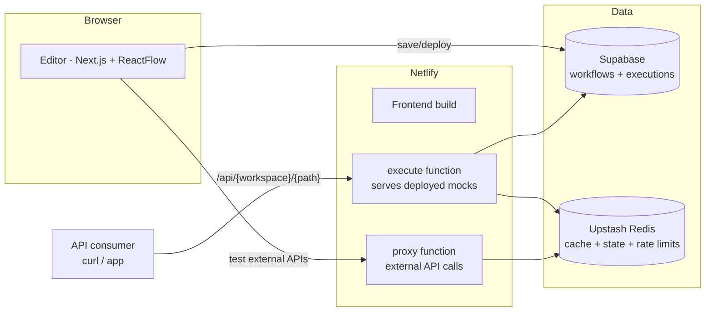

# MockFlow

**Build, test, and deploy mock APIs visually.**

MockFlow is a node-based workflow editor for designing mock API endpoints. Drag nodes onto a canvas — request, validation, transformation, conditional, state, response — wire them together, test the flow in the editor, and deploy it with one click to a live HTTP endpoint you can `curl`.

Built with Next.js 16, ReactFlow, Supabase, Netlify Functions, and Upstash Redis.

## Why

Frontend teams and integration testers constantly wait on backend endpoints that don't exist yet. MockFlow lets you stand up a realistic mock — with validation, branching logic, and persistent state — in minutes, without writing server code.

## Features

| Feature | Status |
|---|---|
| Visual drag-and-drop workflow editor (6 node types) | ✅ |
| In-editor test runner (same engine as production) | ✅ |
| One-click deploy to a live endpoint `/api/{workspace}/{path}` | ✅ |
| Path parameters (`/users/:id`) | ✅ |
| Request validation (required / type / regex / min / max) | ✅ |
| Conditional branching with a safe expression evaluator | ✅ |
| Stateful mocks (state persists across requests via Redis) | ✅ |
| Ready-made workflow templates | ✅ |
| Real HTTP calls to external APIs from Request nodes | ✅ |
| Local API testing via a no-signup SSH tunnel (bundled ngrok agent optional, for a persistent auto-detected tunnel) | ✅ |
| Execution history, rate limiting, response caching | ✅ |
| Undo/redo, keyboard shortcuts, import/export JSON | ✅ |
| User accounts & authenticated multi-tenancy | 🔜 roadmap |
| OpenAPI import/export | 🔜 roadmap |
| Latency simulation & fake-data generators | 🔜 roadmap |

## Architecture



- **Editor** (`frontend/`) — the visual builder. The in-editor Test button runs workflows with the same node semantics as the serving engine.
- **Serving engine** (`backend/`) — Netlify Functions. `execute` looks up deployed workflows by workspace + method + path and executes them server-side; `proxy` relays external API calls (with rate limiting and SSRF guards).
- **Local API access** — the editor's "Local APIs" dialog connects a Request node to an API on your machine via a no-signup SSH tunnel by default; `tunnel-agent/` is an optional ngrok-based CLI for a persistent, auto-detected tunnel instead.

## Quickstart

**Prerequisites:** Node 20+, a free [Supabase](https://supabase.com) project, optionally a free [Upstash Redis](https://upstash.com) database (needed for stateful mocks and rate limiting).

```bash
# 1. Set up the database
#    Open your Supabase project's SQL Editor and run supabase-schema.sql

# 2. Configure the frontend
cd frontend
cp .env.example .env.local   # fill in your Supabase URL + anon key
npm install

# 3. Run
npm run dev                  # editor at http://localhost:3000
```

To serve deployed mocks locally, run the whole stack with the [Netlify CLI](https://docs.netlify.com/cli/get-started/) from the repo root:

```bash
npm install -g netlify-cli
netlify dev                  # frontend + functions at http://localhost:8888
```

Set the backend env vars (`SUPABASE_URL`, `SUPABASE_SERVICE_KEY`, optionally `UPSTASH_REDIS_URL`/`UPSTASH_REDIS_TOKEN`) — see [backend/.env.example](backend/.env.example).

### First workflow in 60 seconds

1. Open the editor → **Templates** → *Simple GET endpoint*
2. Click **Test** to run it in the canvas
3. **Save**, then **Deploy**
4. Copy the endpoint URL from the deploy dialog and `curl` it 🎉

## Deployment

The repo deploys as a single Netlify site (`netlify.toml` builds the frontend and bundles the functions). Set these environment variables in Netlify:

- `NEXT_PUBLIC_SUPABASE_URL`, `NEXT_PUBLIC_SUPABASE_ANON_KEY` — frontend → Supabase
- `SUPABASE_URL`, `SUPABASE_SERVICE_KEY` — serving engine → Supabase
- `UPSTASH_REDIS_URL`, `UPSTASH_REDIS_TOKEN` — optional: caching, rate limits, persistent state
- `ALLOWED_ORIGINS` — comma-separated origins allowed to use the proxy

## Known limitations (honest edition)

- **No user accounts yet.** A *workspace* is an unauthenticated namespace — all queries are scoped to it client-side, and the name works like an access code. Pick something hard to guess; real auth (Supabase Auth + RLS) is the top roadmap item.
- Deployed endpoints are public to anyone with the URL.
- Without Redis configured, State nodes only persist within a single request.

## Repo layout

```
frontend/        Next.js editor UI
backend/         Netlify Functions (execute, proxy, health) + serving engine
tunnel-agent/    Optional ngrok tunnel CLI for a persistent local API connection
supabase-schema.sql   Canonical database schema
docs/archive/    Historical setup notes and legacy schemas
```

---

Built by [Shriraj Patil](https://www.linkedin.com/in/shriraj-patil-526072227/).
